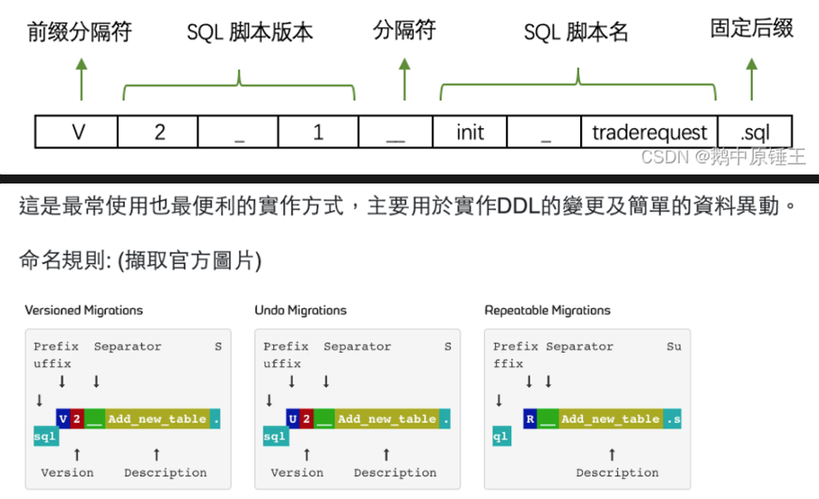

build 資料夾可能包含的檔案範例：
- 構建腳本（Build Scripts）：
  - build.sh：Unix/Linux系統的構建腳本，用於自動化構建過程，例如清理舊的構建文件、設置環境變量、執行go build命令等。
  - build.bat：Windows系統的構建腳本，功能同上。
- Docker相關文件：
  - Dockerfile：用於創建Docker映像的配置文件，其中定義了包括構建應用、設置環境變量和運行應用等步驟。
  - .dockerignore：指定在構建Docker映像時需要忽略的文件和目錄。
    配置文件（Configuration Files）：
- 針對不同環境的配置文件，如dev.config.json、prod.config.json等，存放開發、生產等環境的特定配置。
- 持續集成/持續部署配置（CI/CD Configuration）：
  - .gitlab-ci.yml、.github/workflows/build.yml等，這些文件用於配置GitLab CI/CD或GitHub Actions等持續集成服務的工作流程。
    
# Migration: 採用flyway
- 格式: V{版本}__{動作}_{tableName}.sql
- 遷移的類型
  Versioned Migrations（版本遷移）:** 用於創建、更新、刪除：表、索引、外鍵。
  Undo Migrations（撤銷遷移）:** 即為Versioned Migratios的回滾機制。
  Repeatable Migrations（重複遷移）:** 用於建立views/procedures/functions/packages/…以及批次寫入特定數據。

